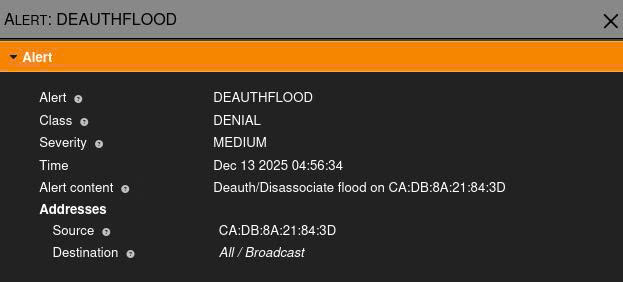
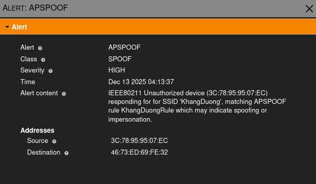
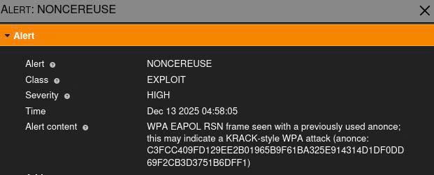

# 🛡️ Wireless Intrusion Detection System (WIDS)

> **Deploying a passive monitoring system to detect anomalies and attacks (DoS, Evil Twin, Exploits) in IEEE 802.11 networks using Kismet.**


## 📖 Introduction

This project focuses on researching and deploying a **Wireless Intrusion Detection System (WIDS)** using **Kismet** on the Kali Linux platform. The system is designed to monitor IEEE 802.11 traffic, detect anomalies, and alert on specific wireless attacks in real-time.

##  ⚠️ Disclaimer
Educational Purposes Only: This project is created for academic research and defensive security testing. The author is not responsible for any misuse of the tools or information provided. Ensure you have permission to monitor and test the networks you are working on.


## 🚀 Key Features

Based on the passive monitoring model, the system successfully detects the following attack vectors:

- **Denial of Service (DoS):**
  - Detects `Deauthentication Flood` attacks targeting specific clients.
  - Detects `Broadcast Disassociation` attacks aimed at network clearing.
- **Impersonation (Evil Twin/Rogue AP):**
  - Identifies Rogue APs using **SSID Whitelisting** and MAC address validation (BSSID).
  - Alerts on `APSPOOF` events when unauthorized devices mimic legitimate networks.
- **Advanced Intrusion Detection:**
  - **Nonce Reuse Detection:** Identifies `KRACK-style` attacks or poorly configured soft-APs used by attackers.
  - **Management Frame Protection (MFP) Analysis:** Alerts when clients connect to networks without MFP, indicating a potential security downgrade.

## 🛠️ Architecture & Tools

- **OS:** Kali Linux
- **Core Engine:** Kismet (Wireless Sniffer & WIDS)
- **Hardware:** USB Wi-Fi Adapter with Monitor Mode & Packet Injection support (e.g., Atheros AR9271, Realtek RTL8812AU).
- **Attack Simulation:** Aircrack-ng Suite (used for validating the WIDS rules)

## ⚙️ Configuration (Detection Rules)

The detection logic is defined in `kismet_alerts.conf`. Key rules implemented:

| Alert Type    | Description                                    | Threshold |
| :------------ | :--------------------------------------------- | :-------- |
| `DEAUTHFLOOD` | Detects rapid deauthentication frames          | 10/min    |
| `BCASTDISCON` | Detects broadcast disassociation frames        | 10/min    |
| `APSPOOF`     | Detects SSID spoofing based on known MACs      | Instant   |
| `NONCEREUSE`  | Detects crypto-nonce reuse (Exploit signature) | 5/min     |

## 📸 Proof of Concept (PoC)

### 1. DoS Detection (Deauth Flood)

_System alerts on massive deauthentication packets aimed at the target._


### 2. Evil Twin Detection (APSPOOF)

_System identifies a Rogue AP broadcasting the trusted SSID "KhangDuong" but with a different MAC address._


### 3. Exploit Analysis (Nonce Reuse)

_Deep packet inspection reveals Nonce Reuse, a signature of the attacker's tool._


## 🔧 Installation & Usage

1. Install Kismet on Kali Linux:
   ```bash
   sudo apt install kismet
   ```
2. Replace the default configuration with the provided files in /configs:
   ```bash
    cp configs/kismet_alerts.conf /etc/kismet/kismet_alerts.conf
   ```
3. Run Kismet in server mode:
   ```bash
   sudo kismet -c wlan0
   ```
4. Access the Web UI at http://localhost:2501.

## Authors:

#### Duong Dinh Ngoc Khang

#### Do Doan Duy Hoang

#### Cao Dang Huy

HCMC University of Technology and Engineering
